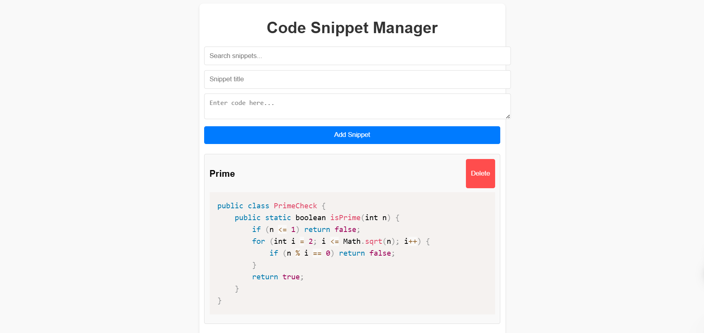

# 🚀 Code Snippet Manager

A sleek and simple React app to manage and store your favorite code snippets! 🔥

---

## 📸 Screenshot

> Add a screenshot named `screenshot.png` in the root or `public/` folder.

---

## 💡 Features

- ✅ Add and save code snippets (with syntax highlighting)
- 🔍 Real-time search filter for snippets
- 💾 Snippets persist in `localStorage`
- 🧹 Clean and responsive UI
- 🧠 Built with React and Prism.js

---

## 🛠️ Technologies Used

- ⚛️ React
- 🎨 CSS
- 💡 Prism.js for syntax highlighting
- 💾 localStorage for data persistence

---

